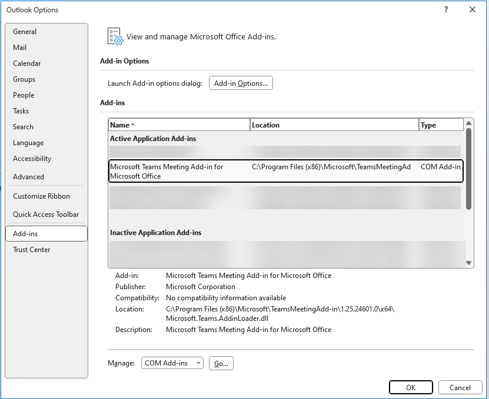
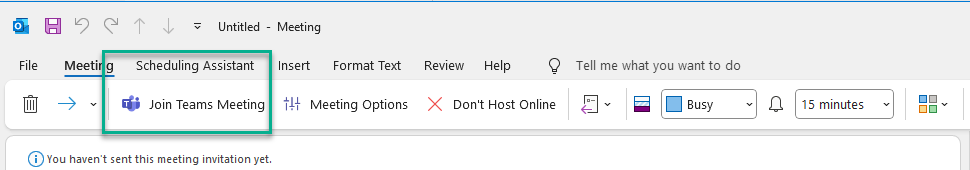
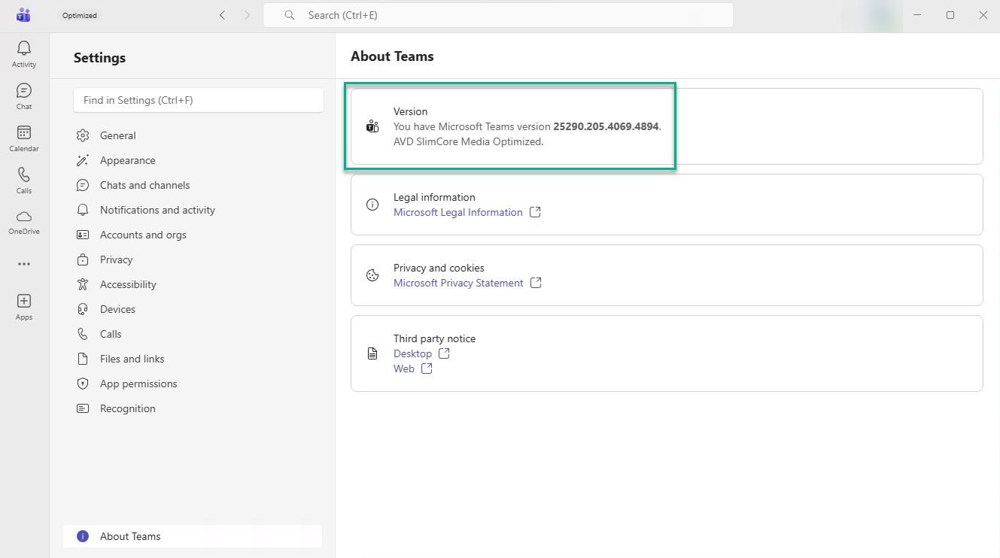

# Install-MicrosoftTeams.ps1  
### Modern, Automated Microsoft Teams Installation Script for Azure Virtual Desktop.
This script fully automates the **installation, cleanup, and repair** of the new Microsoft Teams client (MSIX), Teams Meeting Add-in, WebView2, and WebRTC,optimized specifically for **Azure Virtual Desktop (AVD)**.

It ensures a *clean, reliable, and repeatable* deployment across session hosts, master images, and automated pipelines.

---
## Key Features
- Removes old Teams versions (per-user + machine wide)  
- Installs New Microsoft Teams (MSIX) for **all users**  
- Installs Teams Meeting Add-in (HKLM — persistent for FSLogix profiles)  
- Ensures WebView2 runtime is installed  
- Installs WebRTC service required for Teams optimization  
- Registers Add-in DLLs for Outlook  
- Generates detailed logs under:  `C:\Windows\Temp\CustomScriptLogs`  
- Works with:
  - Azure VM Custom Script Extension  
  - Nerdio Scripted Actions  
  - Master image pipelines  
  - Manual execution on servers 

#  How to Use

## 1. **Azure Virtual Desktop – Custom Script Extension**

Use in automation pipelines or ARM/Bicep:
```bashaz vm extension set
--publisher Microsoft.Compute
--name CustomScriptExtension
--settings '{"fileUris": ["https://raw.githubusercontent.com/
<yourrepo>/Install-MicrosoftTeams.ps1"], "commandToExecute": "powershell -ExecutionPolicy Bypass -File Install-MicrosoftTeams.ps1"}' 
```
## 2.**Nerdio Scripted Action**

Upload the script under:

**Nerdio Manager → Scripted Actions**

Works under:

- VMs
- Host Pool 
- Master Image 


## 3. **Manual Execution**

```powershell
powershell.exe -ExecutionPolicy Bypass -File .\Install-MicrosoftTeams.ps1
```

# Validation Steps

## 1. Validate WebView2
Check Registry:

```text
HKLM\SOFTWARE\WOW6432Node\Microsoft\EdgeUpdate\Clients\
```
Ensure this ID exists:
```text
{F3017226-FE2A-4295-8BDF-00C3A9A7E4C5}
```

## 2. Validate New Teams Package
Run:

```powershell
Get-AppxPackage -Name MSTeams -AllUsers
```
Expected: Teams Version

## 3. Validate Teams Meeting Add-in

Check folder:

```text
C:\Program Files (x86)\Microsoft\TeamsMeetingAdd-in\<version>\
```
Then verify Outlook:

**File → Options → Add-ins**




## 4. Validate WebRTC

```powershell
Get-Service RDWebRTCSvc
```
Status: **Running**

## 5. Teams Optimization Enabled

Inside Teams:

**Settings → About Teams**



# Known Issues

## 1. WindowsApps Folder Access (hardened environments)

The script locates the Teams Meeting Add-in MSI inside:
```text
C:\Program Files\WindowsApps\
```
and then copies it into the working directory, so normal WindowsApps restrictions are not an issue.

However, if the environment has:

- Windows Defender Application Control
- AppLocker blocking system-wide reads
- Custom hardened ACLs on WindowsApps

If that happens, you may see errors around **Add-in MSI path does not exist**.

## 2. New Teams Version Detection Delay

After installation, the new Teams MSIX package (MSTeams) may take several seconds to appear when running:

```powershell
Get-AppxPackage -Name MSTeams -AllUsers
```
What the script does:

- It includes a retry loop: 15 retries × 4 seconds = 60 seconds total wait time

- If Teams still isn’t detected after that, it logs a warning: ```New Teams package not detected post-install.```

No manual action is usually required unless the install itself failed.

## 3. Stale Per-user Teams Folders (FSLogix)

Old Teams remnants (classic Teams or previous MSIX builds) inside FSLogix profiles may conflict.

Location:

```text
%LOCALAPPDATA%\Microsoft\Teams
%LOCALAPPDATA%\Packages\MSTeams_8wekyb3d8bbwe
```
On AVD with FSLogix, you may need to:
- Clean up old containers, or
- Remove old Teams folders from profile VHD(X)

## 4. Administrator Rights Required

Script must run under:

- SYSTEM (Custom Script Extension / Nerdio Script Action)
- Local Administrator

Otherwise, registry and MSI installs may fail.


